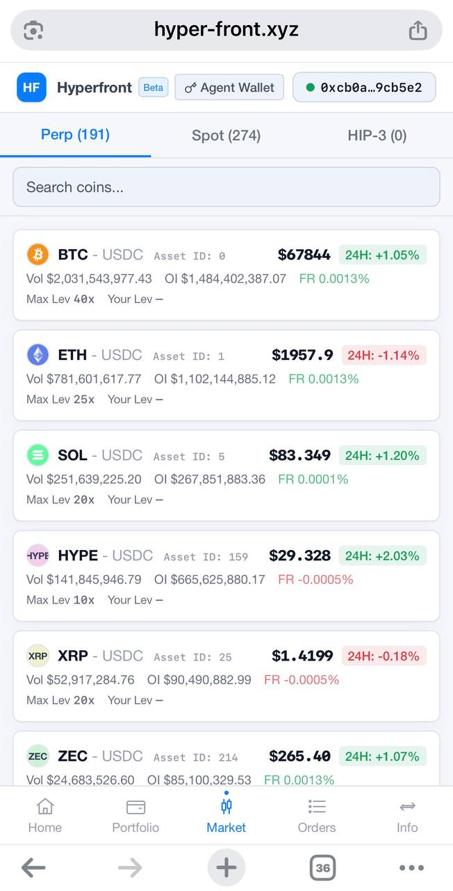
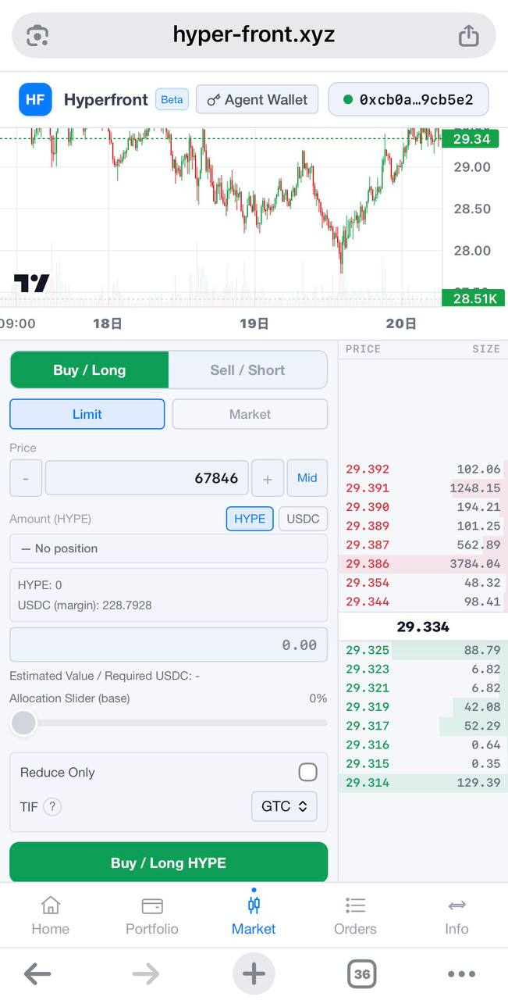

# Hyperfront

<p align="left">
  <a href="https://t.me/open_hyperfront"></a>
  <a href="https://github.com/felix5572/hyperfront/stargazers"></a>
  <a href="https://github.com/felix5572/hyperfront/blob/main/LICENSE"></a>
  
  
</p>

An unofficial, open-source **mobile-first** frontend for Hyperliquid, optimized for phone use.

🌐 **Website**: [https://hyper-front.xyz](https://hyper-front.xyz)  
💬 **Telegram**: [https://t.me/open_hyperfront](https://t.me/open_hyperfront)

---

<p align="center">
  
  &nbsp; &nbsp; &nbsp;
  
</p>

---

## Why This Exists

It's 3am. You're not at your desk. Your phone buzzes — the market just moved hard.

You reach for your laptop — if it's even with you. Wait for it to boot, set up the Internet, log into the exchange... by the time you're ready, the move is already half over. Or worse, you needed to cut a position and you couldn't.

Hyperfront is built for that moment. Install it to your home screen and you're one tap away from entering or exiting a position — no desktop, no waiting.

It's not trying to replace the official interface. It's the thing you reach for when every second counts.

---

## ⚠️ Disclaimer

**Read this before using.**

- **Unofficial.** Hyperfront has no affiliation with Hyperliquid. It is not created, endorsed, or maintained by the Hyperliquid team. When in doubt, use the official interface.
- **Buggy.** This is an early-stage open-source project. There are bugs. Data may be wrong. Orders may behave unexpectedly. Do not rely on it as your only tool. (PRs welcome)
- **Not financial advice.** Nothing shown here constitutes investment advice. You are fully responsible for your own trades and losses.
- **Your keys stay yours.** Hyperfront never asks for your private key or seed phrase. It never will. Order signing happens in your wallet — you approve every action.
- **Verify before you sign.** Only approve wallet prompts you understand. Use an agent wallet with limited permissions and small balances when possible.

---

This project is made available "as is", without warranty of any kind, express or implied, including but not limited to warranties of merchantability, fitness for a particular purpose, or noninfringement. Use at your own risk. It is intended for educational or illustrative purposes only and may be incomplete, insecure, or incompatible with future systems.

---

## Features

- Perp, Spot, and HIP-3 market overview
- Place and cancel orders on mobile
- Open orders, fills, and order history
- Portfolio view: perp account value, spot balances with USD estimates
- Account info: subaccounts, referral, fee tiers, abstraction
- WalletConnect support (scan QR or deep-link from mobile wallet)
- PWA: install to home screen for one-tap access

---

## Security Model

- No private keys are ever sent to any server
- Signing is handled entirely by your connected wallet (MetaMask, WalletConnect, etc.)
- Once signed, orders are transmitted as-is directly (via a simple proxy) to Hyperliquid — the payload is not modified in transit
- Prefer using a [Hyperliquid agent wallet](https://hyperliquid.gitbook.io/hyperliquid-docs/trading/api-trading) with limited permissions for mobile usage

The lightweight order-forwarding service lives in `proxy/` (Caddy).

---

## Local Development

```sh
npm install
npm run dev
```

## Build

```sh
npm run build
npm run preview
```

## PWA Notes

- Android/Chrome: install prompt appears automatically
- iOS Safari: tap Share → Add to Home Screen

Icons in `static/icons/` are placeholder-sized and should be replaced before production.
